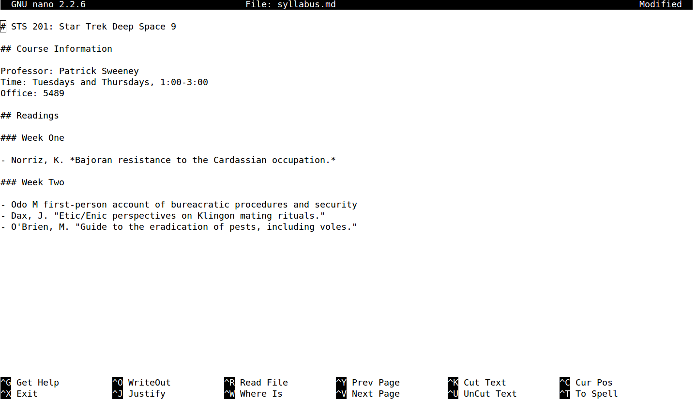

[<<< Previous](gitconfig.md) | [Next >>>](github.md)

# Creating a Syllabus with Markdown

Using `cd`, navigate to the `git` folder inside `projects`. From your home directory, type:

	cd Desktop/projects/git

Now we're going to initialize our repository, which means telling Git to pay attention to it:

	git init

You should see output like this:

	Initialized empty Git repository in /home/patrick/projects/lalala/.git/

### Creating a Syllabus in Markdown

We are going to make our own syllabus as a plain text markdown file.

Let's use our text editor, nano, to create and edit a syllabus file in the folder. Type:

	nano syllabus.md

Once you've entered this command, you wil be presented with the nano text editor in the command line:

## Using Markdown

We'll be using markdown to create a syllabus, and then using Git to track it. Markdown is a markup format that allows us to denote formatting like headings, emphasis, links, and lists in a readable form. Markdown files usually have a `.md` extension.

In markdown, we insert headings like this:

	# My Syllabus Heading
	
A sub-heading (H2) heading looks like this:

	## Readings
	
To provide emphasis, place asterisks around some text:

	*This text will appear italicized.*
	**This text will appear bold.**
	
To create a list, put a hyphen at the beginning of each list item:

	- Reading one
	- Reading two
	- Reading three
	
To create a link, put the anchor text (the text you will see) in square brackets and the URL in parentheses. Don't put a space between them:

	I teach at [The Graduate Center, CUNY](https://www.gc.cuny.edu).
	
Paragraphs of text are denoted by putting a blank line between them:

> This is a paragraph in markdown. It's seperated from the paragraph below with a blank line. If you know HTML, it's kind of like the \
 tag. That means that there is a little space before and after the paragraph when it is rendered.
> 
> This is a second paragraph in markdown, which I'll use to tell you what I like about markdown. I like markdown because it looks pretty good, if minimal, whether you're looking at the rendered or unrendered version. It's like tidy HTML.

Try using these five elements—headings, emphasis, lists, links, and paragraphs—to create a syllabus. Have a main heading that gives the course title (one `#`), then subheadings for, at least, course info and readings. Use emphasis (`*`) for book titles and try to get a list in there somewhere.

You can look at an example syllabus in raw text form [here](https://raw.githubusercontent.com/DHRI-Curriculum/git/master/syllabus.md). When it's rendered by GitHub, it looks like [this](syllabus.md). This is what your markdown might look like in the nano editor:

When you're ready to save your syllabus in Nano, use these steps:

1. Hold `control` and press `x`.
2. You will be asked if you want to save. Press `y` for "yes."
3. You will see a path to your file, which should end with `syllabus.md`. Hit `Enter` and your file will be saved.

That's `control-x`, `y`, then `Enter`. Once your syllabus has been saved, we're ready to start tracking it with Git, which we'll do in the ntext section.

[<<< Previous](gitconfig.md) | [Next >>>](github.md)

[Glossary](glossary.md) ~ ~ ~ [Helpful commands](helpfulcommands.md)
