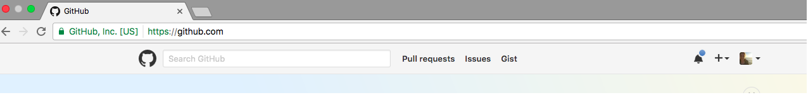
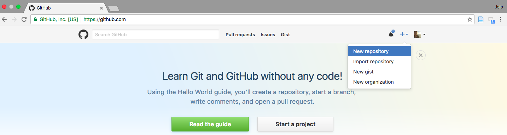
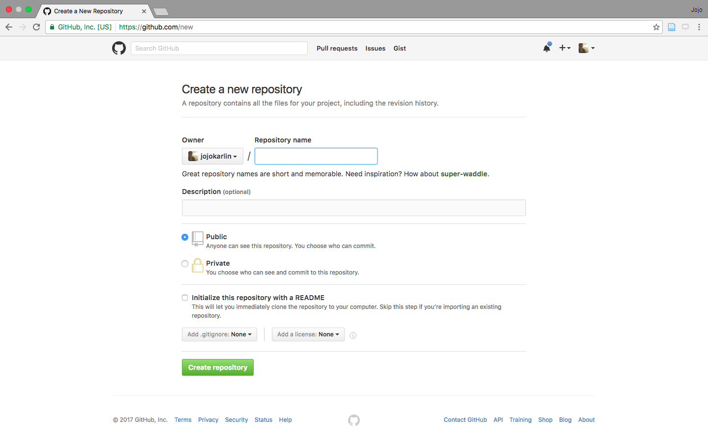
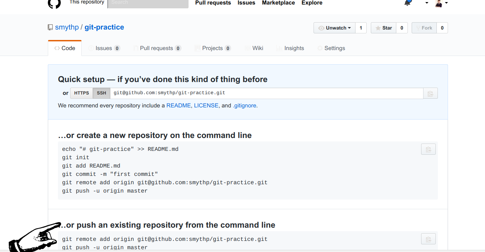

[<<< Previous](markdown.md) | [Next >>>](gitpull.md)

# Connecting to GitHub

Now, let's connect the directory you made to GitHub. GitHub is a service that allows us to host files, collaborate, and find the work of others. Once our syllabus is on GitHub, it will be publicly visible.

Go to GitHub in your browser and click the plus sign in the upper right hand corner.



After clicking the plus button, select `New repository` from the dropdown menu.



After clicking `New repository`, you'll have to enter some information, including a name and description for your repository.



- Choose a name, such as `git-syllabus`.
- Enter a description, such as `Test syllabus for learning Git and GitHub`.
- Keep the `Public — Anyone can see this repository` selector checked.
- Do *not* select `Initialize this repository with a README` since you will be importing an existing repository from your computer.
- Click `Create repository`.

You should end up inside your newly created GitPractice repo. It will look like a set of instructions that you might want to use to connect your GitHub repository to a local repository.

The instructions we want consist of two lines underneath the heading `...or push an existing repository from the command line`. The hand in this screenshot points to where these directions are on the page:



Copy out the first command and paste it in your terminal. It should look something like this:

	git remote add origin git@github.com:<username>/<repository-name>.git
	
You'll need the command copied from your new repo, since it will contain the correct URL.

Next, paste the second command. It will look exactly like this:

	git push -u origin master

After running this command, you should see output that looks like this:

```
Total 4 (delta 3), reused 0 (delta 0)
remote: Resolving deltas: 100% (3/3), completed with 3 local objects.
To github.com:<repo-name>/git.git
   916998f..9779fa7  master -> master
```

If you see output like this, go back to your new repository page in the browser and click the `Refresh` button. You should see your `syllabus.md` file on GitHub!

[<<< Previous](markdown.md) | [Next >>>](gitpull.md)
